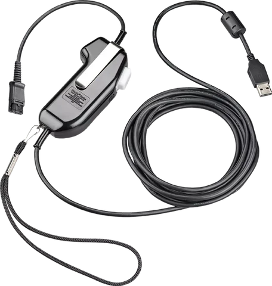

# Plantronics_PTT
Small Python program to interface a Plantronics/Poly PTT USB headset to a serial port to control FlexRadio SmartSDR PTT

The program has been developed with Plantronics/Poly SHS2355-11 PTT headset but it can be easily adopted to any device with a HID interface.

## Why
Flexradio SmartSDR application PTT can be controlled either via CAT or via serial port signal RTS or DTR using the SmartSDR CAT program. In search of a handy PTT device to have possibility of controlling the PTT otherwise than mouse clicking the MOX button on the SmartSDR application, I started to investigate Plantronics SHS2355-11 PTT USB headsets which are used in public safety dispatch centers, etc. They provide a PTT pushbutton as seen in the picture, and also a high-quality USB sound device.

I thought of investigating how the PTT button of the PTT headset device can be read and to utilize the information to create a nice PTT interface for my Flexradio, amongst having then also a dedicated USB audio device for my headset.

## How
Information about the headset states that "The Push-to-Talk switch enumerates as button 1 of a single button game controller"

This lead to start investigating how to first get some data out of the USB device using a Python program reading the HID messages sent by the device. When the PTT button is pressed, the HID device sends message `[9, 1, 0]` , and when the PTT button is depressed, HID device sends message `[9, 0, 0]`.

The code loops around reading and evaluating the received HID message, and controlling the RTS/DTR signals of the configured serial port accordingly. The RTS/DTR signal then eventually control the PTT of the SmartSDR application, which then eventually controls the radio PTT.

With my very bad coding skills and the huge help of ChatGPT, this program was created in one night and I'm really proud of the outcome and it helped me to understand the coders world bit more again.

##
